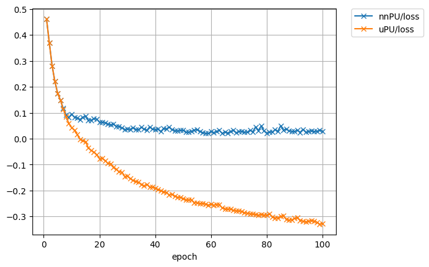
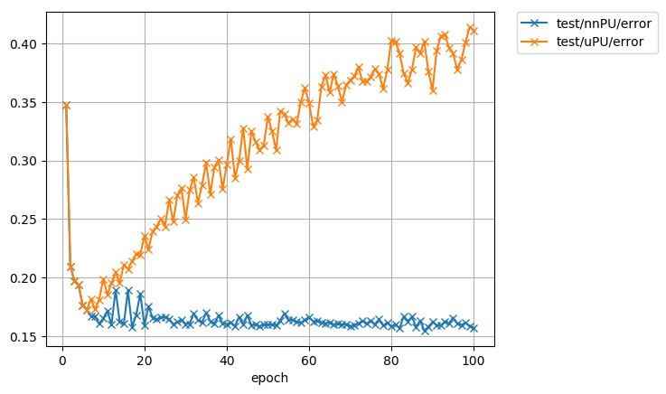

# Chainer example of PU learning and NNPU learning
This is a reproducing code for PU learning [1] and NNPU learning [2].

* ```pu_loss.py``` has a chainer implementation of the risk estimator for PU learning and NNPU learning. 
* ```train_mnist.py``` is an example code of PU learning and NNPU learning. 
The dataset is MNIST [3] preprocessed in such a way that even digits form the P class and odd digits form the N class.
The default setting is 100 P data and 59900 U data, and the class prior is the ratio of P class data in U data.

## Requirements
* Python 3
* Numpy >=1.1
* Chainer >=2.0
* Scikit-learn 0.18

## Quick start
You can run an example code of MNIST for comparing the performance of PU learning and NNPU learning.

    python3 train_mnist.py -g 0

## Example result
After running ```training_mnist.py```, 2 figures and 1 log file are made in ```result/``` by default.
* Training error in ```result/training_error.png```



* Test error in ```result/test_error.png```




## Reference
[1] Marthinus Christoffel du Plessis, Gang Niu, and Masashi Sugiyama. 
"Convex formulation for learning from positive and unlabeled data." 
Proceedings of The 32nd International Conference on Machine Learning. 2015.

[2] Ryuichi Kiryo, Gang Niu, Marthinus Christoffel du Plessis, and Masashi Sugiyama. 
"Positive-Unlabeled Learning with Non-Negative Risk Estimator." Advances in neural information processing systems. 2017.

[3] http://yann.lecun.com/exdb/mnist/
